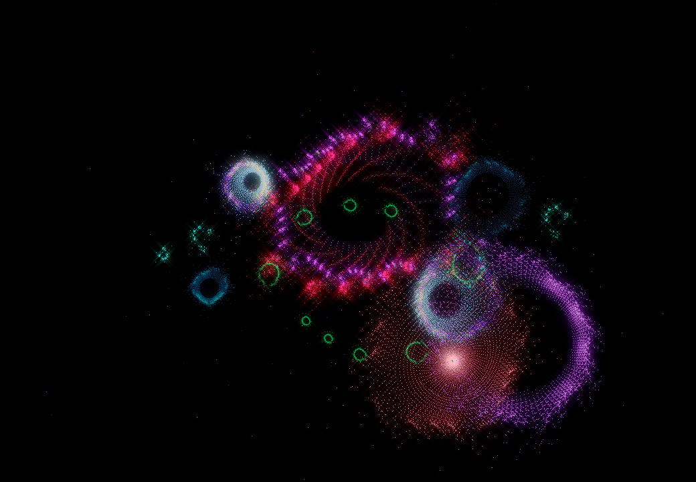
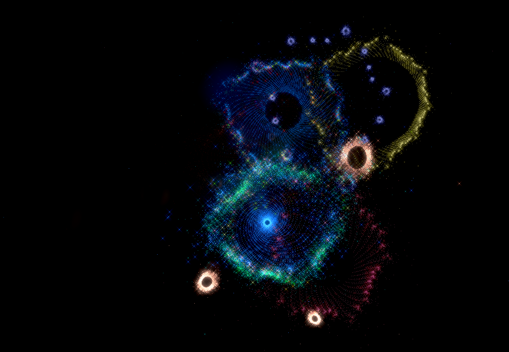
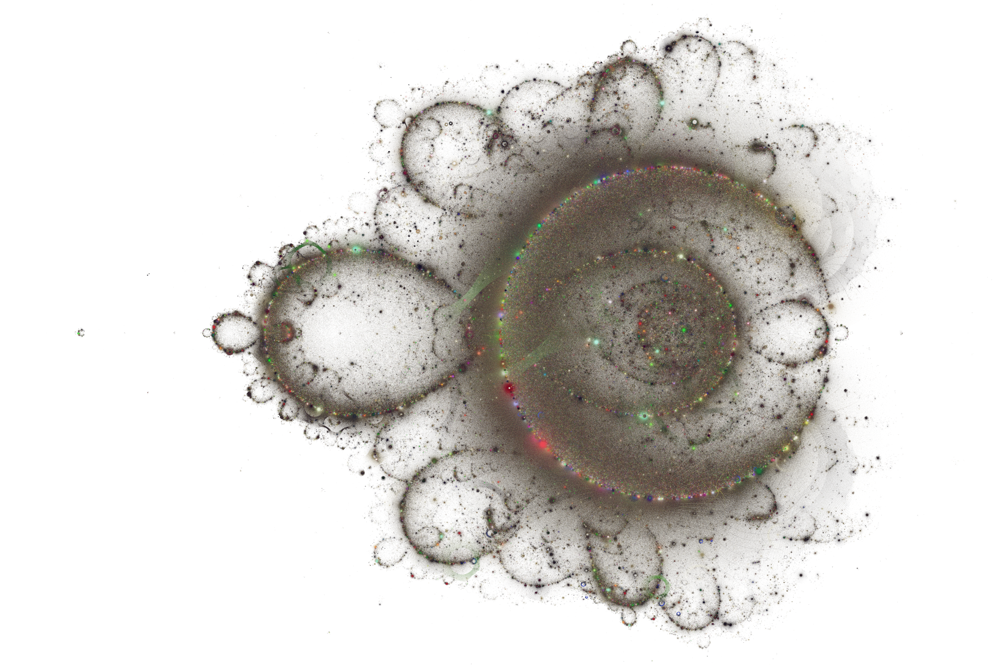

# fractals
fractal rendering using cairographics library

The core of the code is an nhImage class which represents an image.
Classes relevant to different fractals and image painting methods
can be/has been derived from this class to generate png images.

To compile any of this you need to have libcairo libraries.
See how to get it installed for various platforms here https://cairographics.org

Image Samples

